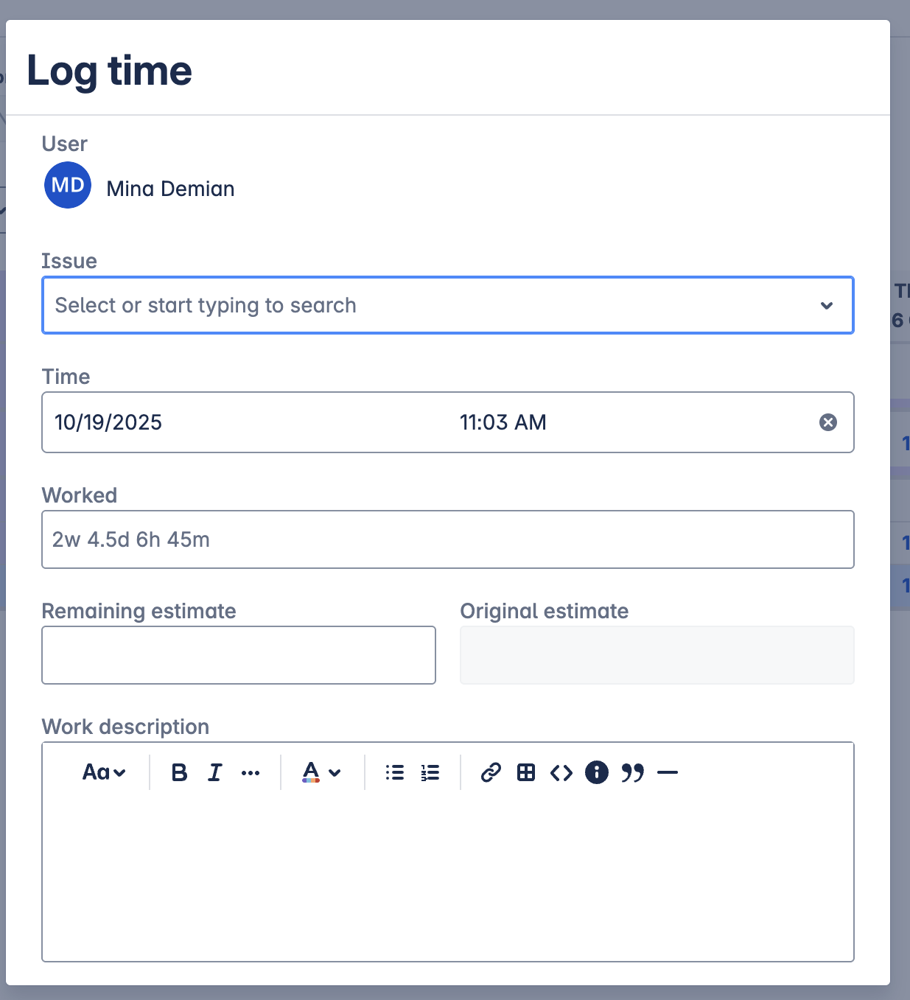
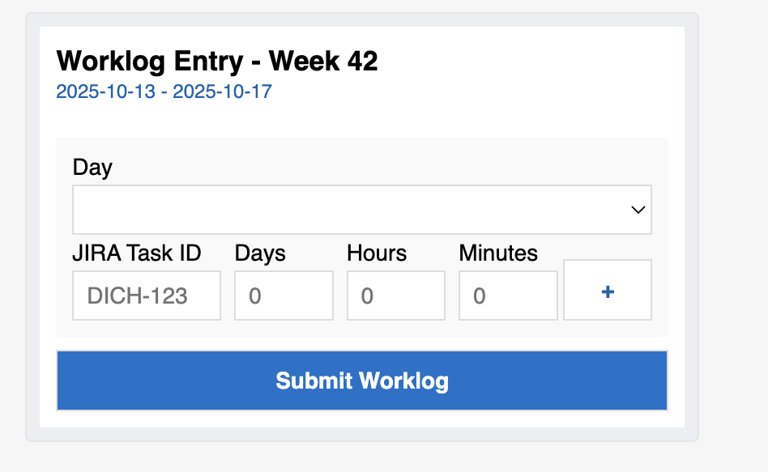
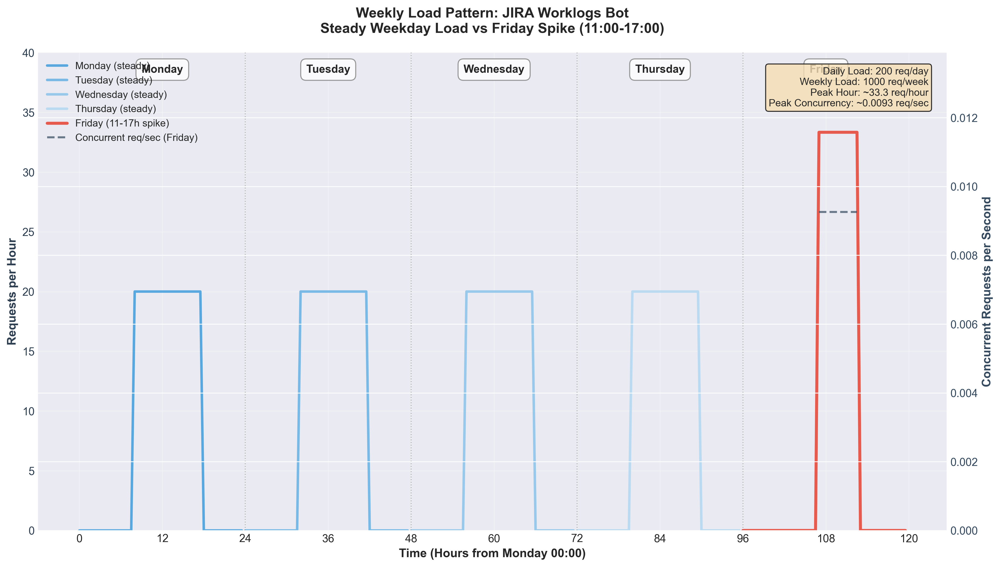

# JIRA Worklogs Bot - System Design Document

> **A Microsoft Teams bot that simplifies JIRA time tracking for engineering teams**

---

## Table of Contents

1. [Background](#background)
2. [Design Goals](#design-goals)
3. [System Context](#system-context)
   - [Implementation Components](#implementation-components)
   - [Integration Points](#integration-points)
   - [Dependencies](#dependencies)
   - [Code Quality](#code-quality)
4. [Proposed Adaptive Card Interface](#proposed-adaptive-card-interface)
5. [Design Decisions](#design-decisions)
6. [Data Flow: Submitting a Worklog](#data-flow-submitting-a-worklog)
7. [Technical Deep Dive](#technical-deep-dive)
   - [Data Models](#data-models)
   - [API Contract: What the Adaptive Card Submits](#api-contract-what-the-adaptive-card-submits)
   - [State Management: Add Row Interactions](#state-management-add-row-interactions)
   - [Error Handling Strategy](#error-handling-strategy)
8. [Known Limitations](#known-limitations)
9. [Failure Modes](#failure-modes)
10. [Thinking Beyond the MVP](#thinking-beyond-the-mvp)
    - [Performance SLOs](#performance-slos)
    - [Visualizing the Load Spike](#visualizing-the-load-spike)
    - [Architectural Implications](#architectural-implications)
    - [AWS Resources Needed](#aws-resources-needed)
    - [Production Readiness](#production-readiness)
    - [Evolution: From MVP to Production](#evolution-from-mvp-to-production)
11. [Lessons Learned](#lessons-learned)
12. [Appendix: Load Simulation Details](#appendix-load-simulation-details)
    - [Interpretation](#interpretation)
    - [Assumptions](#assumptions)
    - [Equations](#equations)
    - [Substituted Values](#substituted-values)

---

## Background

Time tracking is one of those problems every engineer faces... and almost every solution makes it worse. It ends up being a weekly ritual of grappling with JIRA Worklogs. The UI/UX is clumsy and maddening, requiring multiple clicks and page loads.

This doc describes a Microsoft Teams bot that reduces that pain point down to a single Adaptive Card interface.


Once you click on "Log Time", you are presented with this view. Nothing wrong with the view on its own, but I have to repeat this process, especially if I've worked on several tasks across different projects or initiatives.



## Design Goals

The main solution design goals for this project are:

1. **Simplicity**: The new interface should communicate to the user that there will be no new screens or modal.
2. **Efficiency**: The new interface should allow the user to add in their entire week's time report in one view and then click the submit button once!
3. **Minimal Context Switch**: Making it work within Teams is minimal barrier to entry, since we live and work within Teams already.

## System Context

### Implementation Components
- **Microsoft Teams Bot**: A simple Adaptive Card implementation within Microsoft Teams that allows users to log their time reports quickly.
- **Spring Boot 3**: Deployed as a Lambda function in AWS, the application handles the backend logic for processing time reports.

### Integration Points
- **Microsoft Teams**: Bot Framework SDK 4.x, Adaptive Cards 1.5
- **JIRA Cloud**: REST API v3 (worklog endpoints)
- **AWS**: Lambda (Java 17), API Gateway (REST), Secrets Manager

### Dependencies
- External: JIRA Cloud availability (SLA unknown)
- Internal: Bot Framework token service (Azure)

### Code Quality
- unit test coverage
- initial CI/CD pipeline in place (GitHub Actions)
- [coming soon] Qodana static analysis

## Proposed Adaptive Card Interface



## Design Decisions

1. To avoid further setup with Task Modules in Teams, I opted for Adaptive Cards to keep the implementation simple and straightforward. Task Modules would have added complexity without significant benefit for this use case and it would have made it harder for someone else to maintain in the future. 
    > Task Modules (Microsoft's term for modal pop-ups in Teams) would have required hosting a separate web page, integrating the Teams SDK, and handling a more complex `task/fetch/task/submit` message protocol. For a form with five input fields, that's overkill. Adaptive Cards render inline from a JSON payload. The tradeoff is less UI flexibility. But for a worklog form, I didn't need custom HTML.
2. I went with Java to get better at it!
3. I opted for Spring Boot, rather than Micronaut/Quarkus for Lambda because Java is the in-house language of choice and going with another technology (albeit cool!) would have added unnecessary complexity.
3. Although the documentation suggests and encourages the use of Azure Functions for serverless applications, I chose AWS Lambda to keep it to my own AWS setup.

## Data Flow: Submitting a Worklog

1. User types "hello" → Teams sends Activity to `/api/messages`
2. Bot responds with Adaptive Card (pre-filled with current week)
3. User fills JIRA ID, hours → Clicks "Submit"
4. Bot receives `Action.Submit` → Extracts `WorklogEntry[]`
5. For each entry:
    - Validate JIRA ID format
    - Call JIRA API: `POST /issue/{id}/worklog`
    - Track success/failure
6. Respond with summary: "✅ 3 submitted, ❌ 1 failed"


---

## Technical Deep Dive

### Data Models

#### WorklogEntry
The core data structure representing a single time entry. Each worklog entry captures four things: the date, the task identifier, and the time spent (broken into days/hours/minutes for flexibility). We keep everything as strings because Adaptive Card inputs are text-based—parsing happens at the boundary, not in the data model.

```java
@Data
public class WorklogEntry {
    private String day;       // "Monday - 2025-10-13" (parsed to LocalDate)
    private String jiraId;    // "XYZ-123"
    private String days;      // "0" or "1" (optional)
    private String hours;     // "2"
    private String minutes;   // "30"
}
```

**Design Notes:**
- All fields are strings because Adaptive Card inputs are text-based
- The `day` field contains both day name and ISO date for readability
- Numeric fields are parsed to integers in `JiraClient.calculateTimeSpentSeconds()`
- Empty strings default to "0" when calculating time

#### JIRA Worklog Payload
Transformed from WorklogEntry before submission:

```json
{
  "timeSpentSeconds": 9000,
  "started": "2025-10-13T00:00:00+02:00"
}
```

Calculation: `(days × 28800) + (hours × 3600) + (minutes × 60)`

### API Contract: What the Adaptive Card Submits

When a user clicks "Submit Worklog", Teams sends an `Action.Submit` activity to `/api/messages`:

**Bot Framework Activity Structure:**
```json
{
  "type": "invoke",
  "name": "adaptiveCard/action",
  "value": {
    "action": "submit",
    "day_1": "Monday - 2025-10-13",
    "jira_1": "XYZ-123",
    "days_1": "0",
    "hours_1": "2",
    "minutes_1": "30",
    "day_2": "Tuesday - 2025-10-14",
    "jira_2": "PROJ-456",
    "days_2": "",
    "hours_2": "3",
    "minutes_2": "15"
  }
}
```

**Extraction Logic:**
The `extractWorklogEntries()` method loops through rows:
```java
int rowNum = 1;
while (actionData.containsKey("jira_" + rowNum)) {
    String jiraId = actionData.get("jira_" + rowNum);
    if (jiraId != null && !jiraId.trim().isEmpty()) {
        // Create WorklogEntry
        entries.add(entry);
    }
    rowNum++;
}
```

**Key Behaviors:**
- Stops when `jira_N` key is missing (no fixed row limit)
- Skips rows with empty JIRA IDs
- Defaults empty numeric fields to `""` (converted to 0)
- Validates total time > 0 before submitting

### State Management: Add Row Interactions

**Challenge:** How do you add rows dynamically while preserving user input?

**Solution: Stateless Client-Side State**

The "+" button in each row contains:
```json
{
  "type": "Action.Submit",
  "title": "+",
  "data": {
    "action": "addRow",
    "rows": 1
  }
}
```

**When clicked:**
1. **Extract current state:** Loop through all `day_1`, `jira_1`, `hours_1`, etc. in the submitted data
2. **Increment rows:** `newRows = currentRows + 1`
3. **Clone card template:** Generate card with N+1 containers
4. **Pre-fill data:** Re-populate all existing fields with their previous values
5. **Update message:** Use Bot Framework's `updateActivity()` to replace the card in-place

**Code Flow:**
```java
// Extract ALL form data
Map<String, Object> existingData = new HashMap<>();
for (Map.Entry<String, Object> entry : actionData.entrySet()) {
    if (key.startsWith("day_") || key.startsWith("jira_") || 
        key.startsWith("hours_") || key.startsWith("minutes_")) {
        existingData.put(key, entry.getValue());
    }
}

// Create new card with N+1 rows
Attachment updatedCard = createWorklogCard(newRows, existingData);

// Update the existing message
Activity updateActivity = MessageFactory.attachment(updatedCard);
updateActivity.setId(activity.getReplyToId());
turnContext.updateActivity(updateActivity);
```

**Why This Works:**
- ✅ No server-side session storage needed
- ✅ Each interaction is self-contained
- ✅ Teams handles the UI update seamlessly
- ✅ Survives Lambda cold starts (stateless)

**Limitations:**
- Can't recover if user closes Teams (state is ephemeral)
- Card update fails if original message is deleted
- Maximum payload size limited by Bot Framework (~25KB)

### Error Handling Strategy

**Current Implementation:**

| Error Scenario | Behavior | User Feedback |
|----------------|----------|---------------|
| JIRA API returns 4xx | Mark entry as failed | "❌ Failed to submit: PROJ-123" |
| JIRA API returns 5xx | Mark entry as failed | "❌ Failed to submit: PROJ-123" |
| Network timeout | Exception caught, marked failed | "❌ Error submitting worklog: timeout" |
| Invalid date format | Skip entry | "❌ PROJ-123 (invalid date format)" |
| Time = 0 seconds | Skip entry | "❌ PROJ-123 (no time specified)" |
| Empty JIRA ID | Skip during extraction | Not included in submission |

**Response Structure:**
```
✅ Successfully submitted:
• XYZ-123 - 2025-10-13 (2h 30m)
• PROJ-456 - 2025-10-14 (3h)

❌ Failed to submit:
• PROJ-789 (invalid date format)
• PROJ-999
```

**Future Improvements (V2):**
- Exponential backoff retry for transient failures
- Queue failed submissions for later retry
- Validate JIRA task IDs before submission (autocomplete)
- Distinguish between client errors (4xx) and server errors (5xx)

---

## Known Limitations

1. To ship a first version quickly, I opted to keep the JIRA Task ID as a free text input. This means that users need to know the Task IDs beforehand. The next version will integrate with the JIRA API to search for task IDs, as it does right now in JIRA Work Logs.
2. The current implementation does not support editing or deleting previously logged time entries. Future versions will allow you to view, edit, and delete past entries.
3. The current implementation does not yet implement an OAuth2 flow for authenticating with JIRA. This is a critical feature that will be added in future versions to ensure secure access to JIRA accounts.

## Failure Modes

| Failure | Impact | Mitigation |
|---------|--------|------------|
| JIRA API down | Worklogs not logged | Retry with exponential backoff, queue for later |
| Lambda cold start | Slow response | CloudWatch warming (implemented) |
| Invalid Task ID | User frustration | Better validation + JIRA autocomplete (future) |
| Concurrent edits | Race conditions | Not applicable (append-only worklogs) |

---

## Thinking Beyond the MVP

Operating assumption is that the JIRA Worklogs API wouldn't experience high loads, except for when reminders are sent out to submit time reports. This means that concurrent users would be low.

We can think about it then as a theoretical load spike on the backend Java service handling JIRA Worklog submissions from Microsoft Teams. The following graph shows the steady weekday load with the recurring Friday spike (11:00–17:00).

### Performance SLOs

| Metric | Target | Rationale |
|--------|--------|-----------|
| P50 latency | < 500ms | Human perception threshold |
| P99 latency | < 2s | Acceptable for batch submission |
| Availability | 99.5% | Weekly tool, not mission-critical |
| Error rate | < 1% | JIRA API reliability driven |


### Visualizing the Load Spike



<p align="center"><em>Weekly Load Context — including Friday concurrency overlay</em></p>

- **Blue–Purple lines:** Steady weekday load (Mon–Thu)
- **Red line:** Friday load spike (11–17h window)
- **Dashed black line:** Concurrent Friday requests per second (secondary axis)

### Architectural Implications
Given this traffic pattern:

- Cost will be essentially zero (fractions of a cent per week).

- Scaling is handled automatically.

- Cold starts are not an issue because the traffic pattern is predictable (Friday midday burst). A CloudWatch Scheduled Event can be set up at 10:55.

### AWS Resources Needed
- 1 Lambda function
- 1 API Gateway route (POST /worklog)
- _[Optional]_ CloudWatch event rule to wake the function before load time.

### Current Production Readiness
- [x] Logging & monitoring strategy
- [x] Load testing (simulation [below](#appendix-load-simulation-details))
- [ ] OAuth implementation
- [ ] Secrets management (AWS Secrets Manager)
- [ ] Incident response runbook
- [ ] Rollback procedure

### Evolution: From MVP to Production

#### V1: MVP (Current)
- ✅ Single-tenant
- ✅ Basic Auth (hardcoded token)
- ✅ Free-text Task IDs
- **Trade-off**: Security & UX for speed to production

#### V2: OAuth & Autocomplete (Planned)
- 🔄 Multi-user OAuth flow
- 🔄 JIRA Task ID search/autocomplete
- **Trade-off**: Complexity vs. user experience

---

## Lessons Learned

### What Went Well
- Adaptive Cards are surprisingly powerful for complex forms
- Spring Boot's dependency injection made testing easy
- Load analysis prevented over-engineering

--- 

## Appendix: Load Simulation Details

### Interpretation
- Regular load Monday–Thursday is evenly distributed (~200 req/day).
- Friday sees concentrated activity late morning through afternoon.
- Peak ≈ 56 requests/hour (~0.016 req/sec).
- Backend can comfortably handle this within a single instance.

### Assumptions

| Parameter | Symbol | Value | Description |
|------------|---------|--------|--------------|
| Engineers | E | 20 | Active engineers using the bot |
| Tasks per engineer per day | T | 10 | Average number of worklog entries per engineer per day |
| Working days | D | 5 | Monday–Friday |
| Spike window | — | 6 hours | 11:00 → 17:00 on Fridays |

### Equations

**Daily Submissions:**
$$R_{day} = E \times T$$

**Weekly Submissions:**
$$R_{week} = R_{day} \times D$$

**Peak-Hour Load (Friday spike period):**
$$R_{hour\_peak} = \frac{R_{day}}{6}$$

**Average Concurrent Requests (per second):**
$$R_{sec\_peak} = \frac{R_{hour\_peak}}{3600}$$

### Substituted Values

| Metric | Formula | Result |
|---------|----------|--------|
| Total daily submissions | R_day = 20 × 10 | **200 requests/day** |
| Total weekly submissions | R_week = 200 × 5 | **1,000 requests/week** |
| Peak-hour load (Friday 11–17) | R_hour_peak = 200 / 6 | **≈ 33.3 req/hour** |
| Peak concurrency | R_sec_peak = 33.3 / 3600 | **≈ 0.0093 req/sec** |
