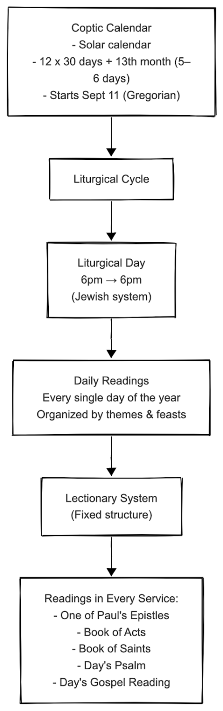
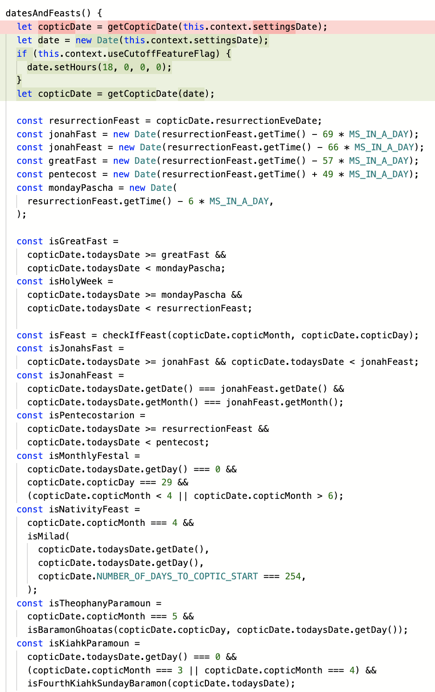
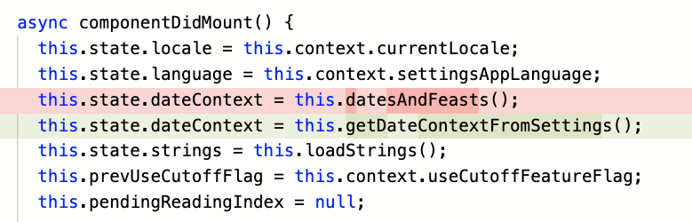

# Part II - Grafting In TDD Into a Legacy React Native Codebase
_Originally written and posted on LinkedIn, December 1, 2025, this is the second installment in this series entitled React Native App in Production Series. Read [part I](part-1-lessons-learned.md) here._

I’ve been maintaining and actively developing KLT ([Google](https://play.google.com/store/apps/details?id=com.copticapps.copticprayersfree&hl=sv) - [Apple](https://apps.apple.com/se/app/koptiska-liturgiska-texter/id1441254651)), since May last year.

## Elevator pitch
> a digital repository for communal prayers and texts in Arabic and Swedish.

This article shows that it’s possible to sew in a growing test suite into a legacy React Native and quicken the evolution from legacy to a more modern codebase. It’s one thing to read about TDD or watch a video about the benefits of TDD; it’s a whole another cigar to see it unfold in real-time! 

## Background
Recently, we uncovered a buried bug that the daily readings were not correct. To explain this, a brief primer about the liturgical (communal prayer) cycle of the church.

<figure style="text-align: center;">
  <p></a></p>
  <figcaption style="text-align: center;">Brief overview of the Coptic calendar + liturgical readings system</figcaption>
</figure>

So, let’s say, it’s a Saturday 18:30 and you take out the app to follow along the readings during the evening service. The logic was still displaying the readings for pre-18:00 day, instead of post-18:00.

## Problem Statement
So, now we know that the app needs to handle two modes of time to display the correct readings. A basic workflow of this could be distilled down to this logic branch:

```
Get current time

If time is before 6pm

    # show today’s readings    
    Count it as today (the current liturgical day)

Else

    # show the next day’s readings
    Count it as the next liturgical day
```

The way that should be specified in the logic is that a 6-hour window is added to the current time, in order to prompt the app internals to display the next day’s readings.

## Path to Resolution
Touching something this critical without any tests in place was out of the question. But there were no tests.

So, I introduced Jest and brought the project up to date with current tooling. Soon, a slew of basic unit tests were going green and covering contained parts of the library were cropping up.

After several rounds of working with the test watcher in real-time, I discovered that the 6-hour window was being applied by default to the timestamp. In that way, the app behavior would always display the following day’s readings.

This produced erratic behavior because sometimes it would appear that the app is working, while other times it was showing the wrong readings. This was confirmed by various users’ bug reports and my own use of the app.

Then, more unit tests pointed me to another discovery - the date calculation was being done freshly on every component render and there was no stored context. This was actually already in the code, but the running test suite just revealed it quicker because I knew where to look now.

By now, the tests were allowing me to introduce some architectural changes albeit slowly. I couldn’t jump from void to full architecture. So, I first set up a repeated method that called the library and calculated the important dates needed.

<figure style="text-align: center;">
  <p></a></p>
  <figcaption style="text-align: center;">intermediary step 1</figcaption>
</figure>

Then, the second intermediary step brought me closer to my desired goal - bringing in a MVVP pattern. I kept the original library file (for now) and set up a new (business) view file that would handle all of the business logic needed. The new business view would now leverage the app’s application context and do the calculations once, reuse many times.

<figure style="text-align: center;">
  <p></a></p>
  <figcaption style="text-align: center;">intermediary step 2</figcaption>
</figure>

I withstood the temptation of over-engineering and chose not to do anything major with the method. The simplest and least expensive refactor was to move the heavy-lifting out of the method and into the library file, and live with the tradeoff of eschewing DRY for multiple instances of the same method for now. To move more robustly towards DRY, I would have had to do a deeper refactor which was out of scope for the PR and original bugfix.

## Numbers
| Phase | Number of Tests |
|----------------|---------------|
| **Pre-bug investigation** | 0 tests |
| **During** | 0-10 green tests |
| **After the PR was merged into trunk** | 40+ green tests |

## Lessons
1. Start with the thinnest possible test layer
2. Incremental architecture beats big-bang rewrites
3. Tests unlock refactoring confidence