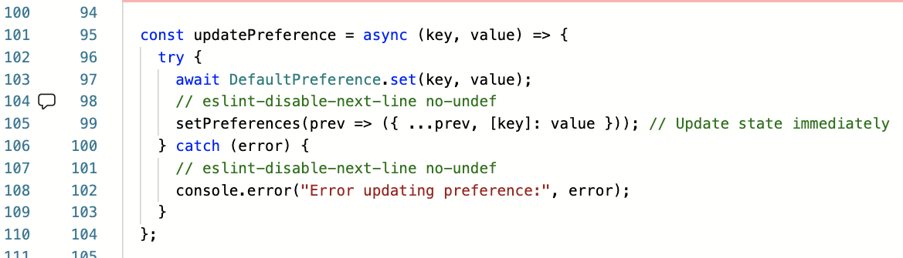
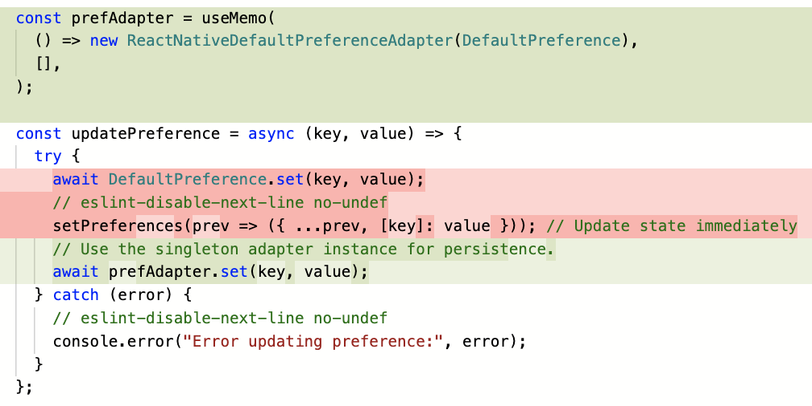
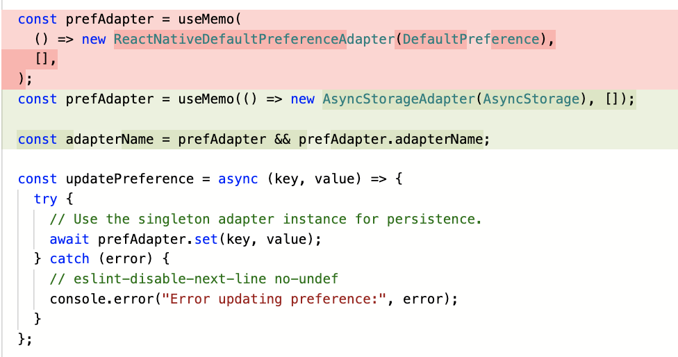
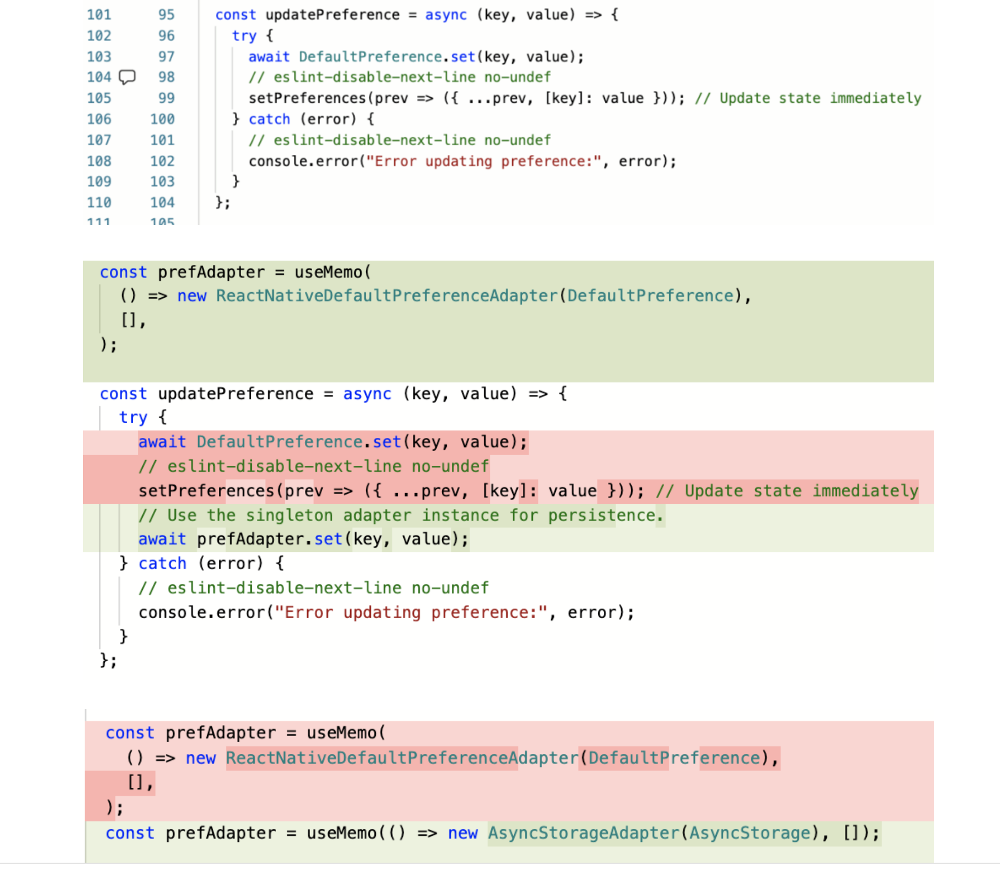

# Part III - Using the Adapter Pattern to Tame Wild React Native Upgrades
_Originally written and posted on LinkedIn, December 5, 2025, this is the third installment in this series entitled React Native App in Production Series. Read [part I](part-1-lessons-learned.md) and [part II](part-2-grafting-in-TDD.md) here._

This is the third installment in my series on maintaining "Koptiska liturgiska texter" (KLT), a digital repository for communal prayers in Arabic and Swedish.

## The Problem
After deferring a React Native upgrade for months, I finally came to the dreaded cul-de-sac: the app wouldn't build anymore for 16kb page sizes without enabling New Architecture. That meant jumping from RN 0.75.2 to 0.79.4—not trivial when your data persistence layer depends on packages with unknown NewArch compatibility.

Two critical dependencies stood out:

react-native-sqlite-storage (database layer)
react-native-default-preference (app settings/local storage)

(This tool (shoutout to @Sandip!) was a great help in identifying which packages to patch and to help me prioritize the order.)

The upgrade path for local storage pointed toward @react-native-async-storage/async-storage, but swapping out a foundational dependency that manages user settings without adequate test coverage felt reckless. The database abstraction could wait, but local storage was blocking the upgrade path. It seemed unwise to just bite the bullet and upgrade, in the absence of specific tests to cover regression.

## The Solution: Adapter Pattern to Mitigate Risk
Rather than replace the library directly, I introduced an adapter pattern to contain the blast radius. This allowed me to:

Abstract the existing implementation behind a stable interface
Implement the new library against the same interface
Validate both implementations independently
Switch between adapters with a single-line configuration change

```typescript
export default class LocalStorageAdapter {

 constructor() {

   this.adapterName = "LocalStorageAdapter";

 }

 async get(key) {

   throw new Error("Not implemented: get(key)");

 }


 async getMultiple(keys) {

   throw new Error("Not implemented: getMultiple(keys)");

 }


 async set(key, value) {

   throw new Error("Not implemented: set(key, value)");

 }


 async setMultiple(entries) {

   throw new Error("Not implemented: setMultiple(entries)");

 }
}
```

## Implementation Strategy
I broke the work into five incremental PRs:

1. Define base adapter interface
1. Wrap existing react-native-default-preference with concrete adapter
1. Write comprehensive unit tests for the existing adapter
1. Implement AsyncStorage adapter against the same interface
1. Switch adapter configuration and validate in production

<figure style="text-align: center;">
  <p></a></p>
  <p></a></p>
  <p></a></p>
  <p></a></p>
  <figcaption style="text-align: center;">Runthrough of the refactor/figcaption>
</figure>

The hypothesis: if the abstraction was sound, switching adapters would be a configuration change, not a risky refactor.

**Result**: The swap worked cleanly. No runtime errors, no behavioral regressions.

## Why This Matters
Deferred React Native upgrades accumulate technical debt that manifests as:

**Security exposure** from unpatched dependencies
**Reduced velocity**, as the gap between current and target versions widens
**Adoption friction**, when it’s difficult to on-board new engineers when faced with outdated tooling
**Forced painful upgrades** when a blocking issue finally surfaces

The adapter pattern isn't just about this upgrade—it's about establishing a pattern for managing dependency risk in a legacy codebase. When (not if) the next breaking change arrives, the abstraction layer is already in place.

## Takeaways for Engineers
Incremental delivery reduces risk. Five focused PRs with comprehensive tests beat one large, risky merge. Each step validated independently means faster rollback if something breaks.

**Abstractions give me more options**. The adapter pattern created a decision point where one didn't exist. Rather than a leap of faith, I could validate both implementations, compare performance characteristics, and make an informed switch.

**Test coverage compounds**. Writing tests for the old implementation before migrating, meant the new implementation had a compatibility target. Tests became executable specifications, not just regression safety nets.

**Don't defer foundational upgrades**. Every month you wait, the gap widens and the surface area of potential breakage grows. What starts as "we'll get to it next quarter" becomes "we need to allocate a full sprint to this."

## What's Next
The database layer (react-native-sqlite-storage) remains on the legacy stack, but now I have a proven playbook. With the app building successfully under New Architecture and the local storage migration validated in production, the database upgrade moves from "high-risk, unknown scope" to "apply the same pattern."

_KLT is available on the Play and App Stores. If you're working through similar React Native upgrade challenges or have thoughts on managing technical debt in app codebases, I'd be interested in your perspective._