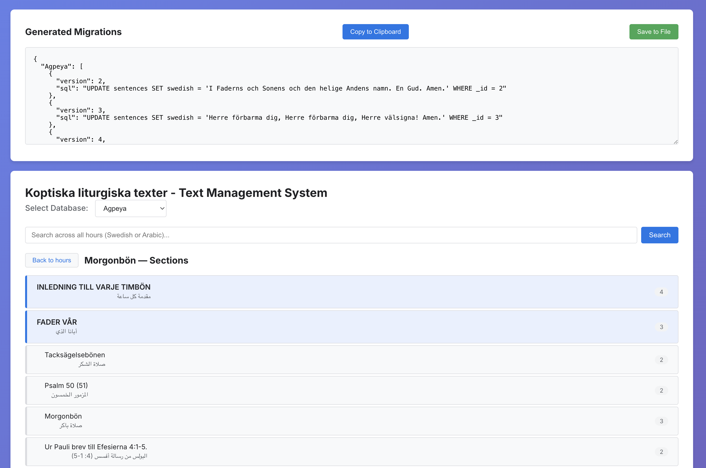

# Part V - Building a Text Management Pipeline for a Legacy React Native App

_This is the fifth installment in this series entitled React Native App in Production Series, on maintaining "_Koptiska liturgiska texter_" (KLT, "Coptic liturgical prayers" in English), a digital repository for liturgical (communal) prayers in Arabic and Swedish. Read [part I](part-1-lessons-learned.md), [part II](part-2-grafting-in-TDD.md), [part III](part-3-using-adapter-pattern.md), and [part IV](part-4-grafting-in-mvvp-pattern.md) here._

## Table of Contents

- [The Greater Problem](#the-greater-problem)
- [Some Background and the Problem](#some-background-and-the-problem)
- [The Solution: A Migration-Based Text Management Pipeline](#the-solution-a-migration-based-text-management-pipeline)
- [Layer Responsibilities](#layer-responsibilities)
- [Why This Architecture](#why-this-architecture)
- [Implementation Strategy](#implementation-strategy)
- [Comparison with Original Workflow](#comparison-with-original-workflow)
- [Alternatives Considered](#alternatives-considered)
- [Limitations and When Not to Use This](#limitations-and-when-not-to-use-this)
- [Takeaways for Engineers](#takeaways-for-engineers)
- [What's Next](#whats-next)

## The Greater Problem

KLT serves a church community that uses the app during live services. Community members — priests, deacons, congregants — are the ones who spot errors: a mistranslated phrase, a missing verse, an outdated rubric. They encounter these problems in real-time, during worship, when accuracy matters most.

But every correction, no matter how small, had to funnel through a single developer. Someone would flag a typo after a service, it would get logged informally, and eventually a developer would open a SQLite file, make the change, rebuild the app, and submit to the app stores. The latency between "someone notices an error" and "the fix reaches users" could be weeks or months.

This wasn't a technical debt problem. It was an organizational bottleneck. The people closest to the content had no way to contribute corrections. The developer — the person furthest from the liturgical domain expertise — was the only one who could make changes. The pipeline needed to invert that: put content management in the hands of the people who know the content, and reduce the developer's role to shipping what they produce.

## Some Background and the Problem

KLT bundles five pre-built SQLite databases: `Agpeya` (Book of Hours), `Kholagy (Divine Liturgy), `Katameros` (Lectionary, book of daily Scripture readings), Bible, and the Holy Week service book. These databases contain thousands of liturgical and religious texts in Arabic and Swedish. Together, they make up the core content of the app.

Content corrections — fixing a typo, updating a translation, adding a missing verse — required manually opening the SQLite file, running an UPDATE statement, copying the modified file into both the Android and iOS asset directories, and submitting a new build to the app stores. There was no visibility into what changed, when, or why. No audit trail. No way for non-technical contributors from the church community to propose corrections.

### Limitations With This Approach

- **No traceability**. Changes are invisible once applied.
- **No integrity checks**. A mistyped SQL statement corrupts data silently.
- **Only a developer can make changes**. Non-technical contributors have no path.
- **Heavy-handed deployments**. A single typo fix requires replacing an entire database file and rebuilding the app.
- **No way to apply incremental changes** — it's all or nothing.

The MVVP pattern introduced in [Part IV](part-4-grafting-in-mvvp-pattern.md) solved the architecture for new screens, but the existing five databases still needed a content management strategy.

The question became: how do you manage content changes across five SQLite databases without manually editing database files or requiring a full rebuild for every correction?

## The Solution: A Migration-Based Text Management Pipeline

The solution is a four-stage pipeline that separates content editing from content delivery:

```
User edits text in React app
        ↓
App generates UPDATE SQL with version, checksum, timestamp
        ↓
POST /api/save-migrations (Vite plugin)
        ↓
Merges with existing migrations, writes to generated/migrations.json
        ↓
yarn migrations:import (copies JSON to RN project)
        ↓
RN app loads migrations on startup
        ↓
PRAGMA user_version check → execute pending migrations in transaction
        ↓
Changes reflected in app
```

1. **Text Management App** — a React + Vite web application that loads SQLite databases client-side using sql.js (WebAssembly). Users browse and edit liturgical texts in the browser.
2. **Migration Capture** — a custom Vite plugin that intercepts each edit, generates a versioned SQL migration with a CRC32 checksum, and persists it to a JSON file on disk.
3. **Migration Import** — a `yarn migrations:import` script that copies the generated JSON from the text management app to the React Native project.
4. **Migration Runner** — on app launch, the RN app loads the migrations, checks `PRAGMA user_version` per database, and applies any pending migrations in transactions.



## Layer Responsibilities

**Text Management App (React + `sql.js`)**

The web app loads SQLite databases entirely client-side using `sql.js` WebAssembly - no server, no API, no database hosting. Users select a database, browse its contents, and edit text inline. Each edit generates a migration immediately:

```javascript
// Each edit produces a versioned migration
const migration = {
  version: lastVersion + 1,
  sql: `UPDATE sentences SET swedish = '${value}' WHERE _id = ${id}`,
  checksum: crc32(sql),
  created_at: new Date().toISOString(),
};
```

The migration is POSTed to `/api/save-migrations` as soon as the user makes a change.

**Vite Plugin — migrationWriterPlugin**

This is custom server middleware, not a build plugin. It runs inside `vite dev` and provides two endpoints:

```javascript
// GET: retrieve existing migrations from disk
// POST: merge incoming migrations with existing, write to disk

function migrationWriterPlugin() {
  return {
    name: "migration-writer",
    configureServer(server) {
      server.middlewares.use("/api/save-migrations", (req, res) => {
        if (req.method === "GET") {
          // Return existing migrations from generated/migrations.json
        }
        if (req.method === "POST") {
          // Load existing migrations
          // Filter: only versions > existing max
          // Merge: [...existing, ...newEntries]
          // Write to generated/migrations.json
        }
      });
    },
  };
}
```

This is zero-infrastructure tooling - no backend deployment, no API server. The Vite dev server is the pipeline.

**Migration JSON (`migrations.generated.json`)**

The output is a JSON file keyed by database name, each containing an array of migrations:

```json
{
  "Agpeya": [
    {
      "version": 2,
      "sql": "UPDATE sentences SET swedish = 'Herre, förbarma dig' WHERE _id = 42",
      "checksum": "06865c7b",
      "created_at": "2026-03-01T23:00:52.978Z"
    }
  ],
  "Kholagy": [],
  "Katamars": [],
  "Bible": [],
  "Dlal": []
}
```

Append-only. New migrations never overwrite old ones. The file is version-controlled.

**Migration Runner (migrations.js)**

The RN app consumes the JSON on startup:

```javascript
let imported = {};
try {
  imported = require("./migrations.generated.json");
} catch (_e) {
  // No generated migrations file — that's fine.
}
```

Each database has a baseline migration (version 1, `SELECT 1` — a no-op). Generated migrations are merged with the baseline, and the runner checks `PRAGMA user_version` to determine what's pending:

```javascript
async function runMigrations(db, dbName) {
  const currentVersion = await getVersion(db);
  const pending = MIGRATIONS[dbName].filter(m => m.version > currentVersion);

  for (const migration of pending) {
    if (migration.checksum) {
      const computed = crc32(migration.sql);
      if (computed !== migration.checksum) {
        throw new Error("checksum mismatch — migration may be corrupted");
      }
    }

    await db.transaction(tx => {
      tx.executeSql(migration.sql);
      tx.executeSql(`PRAGMA user_version = ${migration.version}`);
    });
  }
}
```

Each migration runs in a transaction. Atomic or nothing.

## Why This Architecture

### Maintainability

Content changes are isolated to SQL migrations. No manual database file editing. Every change is timestamped, checksummed, and version-controlled. A content correction is a single JSON entry, not a replaced database file.

### Discoverability

The migrations JSON is checked into git. You can see exactly what changed, when, and in which database. `git log` on `migrations.generated.json` gives you a complete audit trail of every content change.

### Zero Infrastructure

The entire pipeline runs locally. The text management app is a Vite dev server. The migration capture is server middleware. The import is a copy command. No backend, no hosting, no auth, no API surface to maintain.

## Implementation Strategy

I implemented this incrementally:

1. Build the migration runner in the RN app (PRAGMA user_version + transaction execution)
2. Create the baseline migrations (version 1 no-op per database)
3. Build the Vite plugin for migration capture (`migrationWriterPlugin`)
4. Build the text management UI with sql.js for client-side database editing
5. Wire the import script (`yarn migrations:import`)
6. Test end-to-end: edit in browser → generate migration → import → launch app → verify change

The migration runner was built first because it could be tested independently with hand-crafted migration JSON files before the text management app existed.

## Comparison with Original Workflow

| Aspect | Manual Database Editing | Migration Pipeline |
|--------|------------------------|-------------------|
| Content changes | Edit SQLite file directly | Edit in browser UI |
| Traceability | None | Versioned, timestamped, checksummed |
| Integrity | Hope for the best | CRC32 validation per migration |
| Who can contribute | Developer with SQLite knowledge | Anyone with the web app |
| Deployment | Replace entire database file | Append migrations to JSON |
| Audit trail | None | Git history on migrations.json |

## Alternatives Considered

**OTA content updates.** Fetching migrations from a server at runtime would eliminate the manual import step. But KLT is offline-first — users open it during church services where connectivity is unreliable. Adding a network dependency for migration delivery would introduce failure modes at the worst possible time. It also adds infrastructure: a server, an API, authentication, error handling for failed downloads.

**Replace database files entirely on each release.** Simpler than a migration system — just ship new database files. But the Bible database alone is 20MB. A single typo fix shouldn't require shipping 20MB of unchanged data. Incremental migrations are smaller, faster, and make the change visible in the diff.

**CMS with API.** A full content management system would add hosting, authentication, and an API surface. The content changes infrequently and the pipeline is single-maintainer. A CMS solves problems KLT doesn't have while adding infrastructure KLT doesn't need.

## Limitations and When Not to Use This

**Manual copy step.** `yarn migrations:import` is a manual bridge between two projects. It works for a single maintainer, but wouldn't scale for a team without CI automation linking the two repositories.

**Append-only migrations.** There's no rollback mechanism. A bad migration requires a corrective migration, not a revert. At the current scale this is acceptable — migrations are simple UPDATE statements. At larger scale, with schema changes or data transformations, the lack of rollback would be a liability.

**Client-side sql.js constraints.** Large databases are slow to load in the browser via WebAssembly. The Bible database (20MB) takes noticeably longer than the smaller liturgical databases. This is a usability constraint on the text management app, not a correctness issue.

## Takeaways for Engineers

**Use what you have.** Vite's dev server middleware is a zero-cost way to build dev-time tooling without adding infrastructure. Before reaching for a backend, check whether your existing build tool can serve the need.

**PRAGMA user_version is underrated.** SQLite gives you migration state tracking for free — no version table, no external state file, no migration history table. It's a single integer stored in the database file header, and it's exactly enough.

**Checksums catch what tests don't.** CRC32 on each migration detects corruption between generation and execution. A migration that was valid when created but corrupted in transit (copy error, encoding issue) fails loudly instead of silently corrupting data.

**Separate the content pipeline from the app pipeline.** The RN app doesn't know or care how migrations were generated. It just applies them. This means the text management app can be rewritten, replaced, or extended without touching the mobile app's database layer.

## What's Next

- Automate the import step with a CI hook or file watcher between the two repositories
- Add a diff view in the text management app showing before/after for each edit
- Extend the pipeline to support the MVVP JSON files from Part IV, not just database content

_KLT is available on the [Play](https://play.google.com/store/apps/details?id=com.copticapps.copticprayersfree&hl=sv) and [App](https://apps.apple.com/se/app/koptiska-liturgiska-texter/id1441254651) Stores. If you're working through similar content management challenges in production mobile apps, I'd be interested in your perspective._
