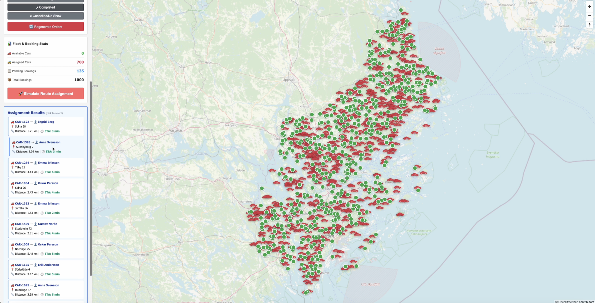
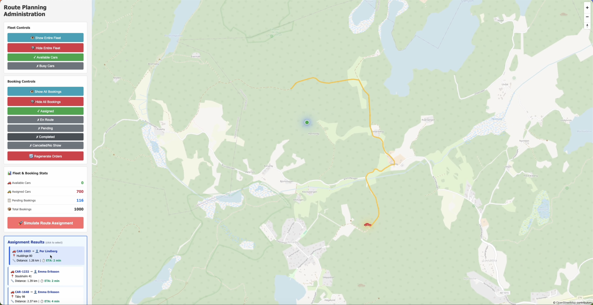

# Building a Route Optimization Engine in 4.5 Hours: An LLM-Assisted Hackathon Post-Mortem

A coworker and I built a working route optimizer during a work hackathon
using GitHub Copilot (running Claude Sonnet 4.5) as a third team member.
By the time we put down our tools, we had 315 mock cars assigned to over
1000 mock bookings with real distance calculations via the AWS Location
Service API.

<figure>

<figcaption>Screencast: (click to watch)</figcaption>
</figure>

The interesting part isn't *just* what we built. It's how we kept an AI
coding agent from derailing us.

------------------------------------------------------------------------

## The Constraint Design

I brought to this hackathon a hypothesis: that LLM-based coding
assistants need **strict constraints** to avoid derailing a project.
Without guardrails, they tend to make overconfident architectural
decisions, introduce technical debt, and generate unmaintainable code.

Here's the prompt we used:

> **Way of Working**
>
> We drive, you execute.
>
> You don't make architectural or design decisions without our express
> written confirmation.
>
> Small, focused edits in non-contiguous blocks of max 5 lines in one
> file only. No multi-file changes simultaneously.
>
> No shortcuts, ugly hacks, workarounds, or "getting things to work."
> Always offer an execution plan if we can't resolve a bug and you
> always defer to us for the final decision on how to resolve something.
> We have veto power.
>
> You work autonomously only when we specify with express written
> confirmation. Always assume that you will get confirmation from us.

I've been burned by AI coding agents before. They're simultaneously
overconfident and then overly apologetic when it all comes crashing down
after a botched change. This overtly clear tone and these demarcations
have proven to jolt the agent into registering that we are not going to
be vacant at the wheel.

### Why Each Constraint Matters

**"We drive, you execute"** --- Sets the relationship. We lead and the
AI follows. This prevents the drift where you start deferring to the
agent because it sounds confident.

**"5 lines, one file"** --- This is really from having spent time on
retracing steps back to the original task because an ambitious edit
broke several files. Multi-file changes are where things break in
unexpected ways and then more time is spent reverting or fixing. This
constraint forces small, reviewable changes that can be reverted with
`git`.

**"No shortcuts, ugly hacks, workarounds"** --- This is watching hours
of LLM output. I've seen them say "let's just do this to move on" or
"let's go nuclear." LLMs optimize for 'working now', not 'maintainable
later'. This rule is the difference between hackathon code you can
extend and hackathon code you throw away.

**"Veto power, express written confirmation"** --- The AI needs to know
we're watching and we will exercise that power. Without this, it starts
making implicit architectural decisions through code generation.

### The Trade-off

These constraints slow initial velocity. The first 90 minutes felt
slower than uncontrolled generation would have. But they prevent the
2-hour debug spirals that usually eat the second half of a hackathon. We
had zero "TODO: fix this hack" comments in the final code.

------------------------------------------------------------------------

## The Build

My coworker is one part full-stack, several sharp parts
platform/infrastructure. I'm the full-stack engineer. He set up the
initial project structure in about 90 minutes, while I got us set up in
GitHub.

### Hour 1: Scope Pivot

**Decision point:** We moved away from the initial concept of an A-to-B
route planner, native to a consumer app. We kept our route planning
department in mind and asked ourselves, what would they want to see?
This led us to a dashboard view with a map, a list of drivers and
travelers, and some toggles to filter what you could see on the screen.

The initial plotting of drivers and orders looked odd. We jostled with
Copilot to get it to spread the markers out.

{style="width:80.0%"}

### Hour 2: Geographic Boundaries

Copilot couldn't understand our requests to spread markers against the
boundaries of Stockholm county. It kept clustering them or distributing
them wrong.

**Our intervention:** We manually provided a publicly-available JSON
file with the dimensions for Stockholm county and got explicit about the
randomization logic. Copilot then generated correct distribution code.

**Learning:** LLMs handle specific APIs well, but struggle with implicit
geographic and domain knowledge. We found that providing structured data
gave us the cleanest results.

We also instructed Copilot to switch to street maps instead of satellite
view, and it switched to another map provider by itself. This
demonstrated that the LLM took good initiative within clear constraints.

{style="width:80.0%"}

### Hour 2.5: The Win --- AWS Location Service

We built the basic assignment logic (naive closest-driver assignment)
quickly. But we needed real distance calculations to make it credible
and to meet the core requirement of the hackathon brief.

This is where Copilot shone.

We gave it a terse prompt: "Use Amazon Location Service API to calculate
routes. POST /route-matrix endpoint." Then we attached a direct link to
the AWS documentation.

Copilot implemented the route calculation and rendering on the map with
no errors. No iteration. Just straight-up working code.

<figure>

<figcaption>Screencast: (click to watch)</figcaption>
</figure>

I'm not a high-fiver, but there were reports of high-fiving and
fist-bumping in the room.

**Learning:** This is what LLMs are good at --- taking well-documented
APIs and generating boilerplate integration code. The constraint to
"provide documentation links" paid off immediately.

### Hour 3: Frontend Performance

The richness of the icons initially selected were making the map both
cluttered and difficult to read. The map was also chugging when
rendering.

We instructed Copilot to pick simpler, sleeker icons, and relied on
color rather than iconography to differentiate drivers from travelers.
Immediate performance improvement.

**Design decision:** This was a human UX call that Copilot couldn't make
--- it needed explicit direction on *why* to simplify, not just *how*.

{style="width:80.0%"}

### Hour 4.5: Demo Cutoff

The demo session happened earlier than expected, so we stopped here.

**What we shipped:** - 315 cars assigned to 1000+ bookings - Real
distance calculations via AWS Location Service - Working route
visualization - ETA estimates

**What we didn't ship:** - EKS deployment (boilerplate generated but not
executed) - Actual optimization algorithm (used naive closest-driver
assignment) - Constraint handling (promised in the original spec, not
implemented)

{style="width:80.0%"}

------------------------------------------------------------------------

## Reflections

### What Worked

**Constraint-driven development prevented debt.** Zero "fix this later"
comments. The code is maintainable, not just demo-able.

**API integration was flawless when we provided docs.** The AWS Location
Service implementation was the highlight. Clear documentation + explicit
instructions = perfect execution.

**Continuous review caught errors early.** Watching output in both the
browser and the IDE meant we caught mistakes before they compounded. The
5-line limit made every change reviewable.

### What Didn't Work

**The LLM can't infer domain knowledge.** Geographic boundaries, UX
paradigms, optimization algorithms --- all required explicit human
specification. Copilot never once questioned whether we were solving the
right problem. In my experience, LLMs can't think laterally or out of
the box. (Although Opus 4.5 seems to be improving at this.)

**Constraints slow you down initially.** The first 90 minutes felt
laborious. You have to trust that it pays off in the back half.

**No architectural vision from the AI.** It proposed implementations but
never said "have you considered X instead?". So far, that's still a
human job.

### Where This Approach Breaks Down

**Don't use this when exploring problem space.** If you don't know what
you're building, tight constraints will slow you down without the
payoff.

**Don't use this for well-understood domains.** Standard web CRUD,
common algorithms --- the LLM knows these well enough that heavy
constraints add friction without benefit.

**Don't use this if you'll throw away the code.** The whole point is
maintainability. If it's a true throwaway prototype, let the AI move
fast.

**Don't use this if you can't provide effective constraints.** The
approach requires you to know what good architecture looks like. If
you're learning, uncontrolled generation might teach you more.

------------------------------------------------------------------------

## Key Findings

AI coding assistants aren't mature pair programmers. Think of them as
extremely capable junior engineers with low reasoning ability and (still
nascent) lateral thinking.

These junior coworkers of ours deliver their most value when they're
provided with:

- **Explicit constraints** to prevent overconfident bad decisions
- **Continuous human oversight** to catch subtle errors
- **Clear architectural direction** because they can't provide it
- **Well-scoped tasks** since they can't decompose complex problems

This hackathon helped us verify my initial hypothesis. I'm happy with
the working app and it acted like an incubator where we could
demonstrate disciplined collaboration between man and AI.
